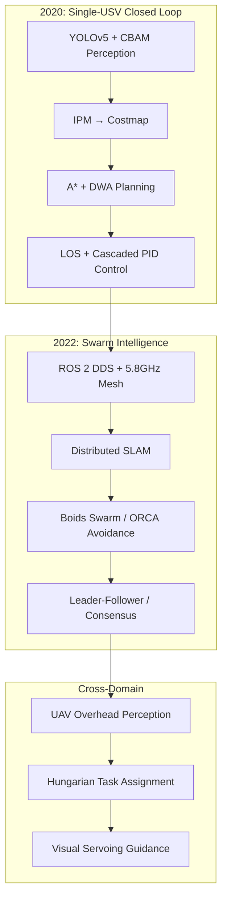

# USV Swarm — Cooperative Perception & Autonomous Navigation System

Multi-USV swarm system for water surface operations, developed in two phases:
- **2020**: Single-USV autonomous navigation closed loop (perception → SLAM → planning → control)
- **2022**: Decentralized multi-USV swarm coordination + UAV-USV cross-domain collaboration



## Architecture

```
ros2_ws/src/
├── usv_bringup/         # Launch files (single + multi-boat)
├── usv_description/      # URDF model + meshes (50-80cm hull, dual propellers)
├── usv_gazebo/           # Simulation worlds + wave plugin config
├── usv_perception/       # YOLOv5 detector + CBAM attention module
├── usv_slam/             # Cartographer 2D SLAM config + launch
├── usv_navigation/       # IPM transform, costmap builder, nav2 params
├── usv_control/          # LOS guidance, cascaded PID, differential drive
├── usv_calibration/      # Camera-IMU extrinsic calibration, IMU de-jitter
├── usv_swarm/            # DDS discovery, QoS, Boids, ORCA, leader-follower,
│                         # consensus, distributed SLAM, role assignment
└── uav_bridge/           # UAV overhead perception, Hungarian assigner,
                          # visual servoing, star topology, BEV mapper
```

## Tech Stack

| Layer | Technologies |
|-------|-------------|
| Perception | YOLOv5 + CBAM attention, inverse perspective mapping (IPM) |
| SLAM | Google Cartographer 2D, distributed C-SLAM |
| Planning | A\*, DWA (ROS 2 nav2) |
| Control | LOS guidance, cascaded PID (anti-windup, integral separation, derivative-first) |
| Swarm | Boids (cohesion/alignment/separation), ORCA (with R-tree spatial index: O(N²)→O(N log N) neighbor queries), leader-follower L-α, consensus |
| Communication | ROS 2 DDS, 5.8GHz Mesh, QoS profiles (Best Effort / Reliable) |
| Cross-Domain | UAV overhead BEV, Hungarian assignment, visual servoing, star topology |
| Calibration | Camera-IMU hand-eye, complementary filter IMU de-jitter |
| Simulation | Gazebo + VRX wave plugin (current, wind, buoyancy) |
| Deployment | Docker (osrf/ros:humble-desktop), docker-compose multi-container |
| CI/CD | GitHub Actions (pytest) |

## Quick Start

```bash
# Prerequisites: ROS 2 Humble, Gazebo, colcon
sudo apt install ros-humble-desktop ros-humble-gazebo-ros-pkgs \
  ros-humble-navigation2 ros-humble-cartographer-ros

# Build
cd ros2_ws && colcon build --symlink-install && source install/setup.bash

# Single boat simulation
ros2 launch usv_bringup single_boat_sim.launch.py

# 3-boat swarm simulation
ros2 launch usv_bringup multi_boat_sim.launch.py

# Full UAV-USV cross-domain simulation
ros2 launch uav_bridge uav_usv_bridge.launch.py

# Docker (one container per USV + Gazebo)
docker compose up
```

## Running Tests

```bash
cd ros2_ws && colcon build && source install/setup.bash
pytest tests/ -v
```

## Data Notice

This repository contains **simulated data only** (Gazebo VRX). All real-vessel sensor recordings (camera images, GPS logs, IMU streams) have been desensitized and are not included. The `data/mock/` directory contains synthetic sensor logs for testing purposes only. The simulation is fully reproducible — run `docker compose up` to replicate all experiments.

## License

MIT
