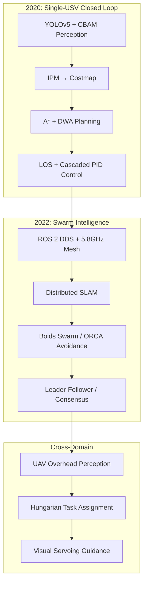

# USV Swarm — Cooperative Perception & Autonomous Navigation System

Multi-USV swarm system for water surface operations, developed in two phases:
- **2020**: Single-USV autonomous navigation closed loop (perception → SLAM → planning → control)
- **2022**: Decentralized multi-USV swarm coordination + UAV-USV cross-domain collaboration



## Tech Stack

| Layer | Technologies |
|-------|-------------|
| Perception | YOLOv5 + CBAM attention, inverse perspective mapping (IPM) |
| SLAM | Google Cartographer 2D, distributed C-SLAM |
| Planning | A*, DWA (ROS 2 nav2) |
| Control | LOS guidance, cascaded PID (anti-windup, integral separation, derivative-first) |
| Swarm | Boids (cohesion/alignment/separation), ORCA, leader-follower L-α, consensus |
| Communication | ROS 2 DDS, 5.8GHz Mesh, QoS profiles |
| Cross-Domain | UAV overhead BEV, Hungarian assignment, visual servoing |
| Simulation | Gazebo + VRX wave plugin |
| Deployment | Docker (osrf/ros:humble-desktop), docker-compose multi-container |

## Quick Start

```bash
# Build
cd ros2_ws && colcon build --symlink-install

# Single boat simulation
ros2 launch usv_bringup single_boat_sim.launch.py

# 3-boat swarm simulation
ros2 launch usv_bringup multi_boat_sim.launch.py

# With UAV bridge
ros2 launch uav_bridge uav_usv_bridge.launch.py

# Docker
docker compose up
```

## Data Notice

This repository contains **simulated data only** (Gazebo VRX). All real-vessel sensor recordings have been desensitized and are not included. The simulation is fully reproducible — run `docker compose up` to replicate all experiments.
